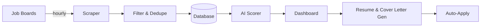

[](https://www.typescriptlang.org/)
[](https://nextjs.org/)
[](https://supabase.com/)
[](https://nodejs.org/)
[](https://turbo.build/)
[](https://pnpm.io/)
[](https://tailwindcss.com/)
[](https://www.radix-ui.com/)
[](https://claude.ai/code)

# Rocket Jobs App

An AI-powered job search pipeline that scrapes, scores, generates tailored documents, and auto-applies to the best remote roles - so I can focus on interviewing, not searching.

Job hunting is a full-time job. I got tired of refreshing five different job boards, skimming hundreds of listings, and losing track of which ones were actually worth applying to. So I built a system that does it for me - scrapes listings across multiple boards, scores every role against my actual preferences using Claude, generates tailored resumes and cover letters, and auto-applies to the top matches.

## How It Works



## Architecture

```
Data Flow:
[RemoteOK]    -|
[WWR]         -|
[Himalayas]   -|-> [Scraper] -> [Keyword Filter] -> [Dedupe] -> [Supabase DB]
[Jobicy]      -|                                                      |
[Google Jobs] -|                                               [AI Scorer]
                                                                      |
                                                               [Dashboard]
                                                                      |
                                                        [Resume/Cover Letter Gen]
                                                                      |
                                                              [Auto-Apply]
```

```
Package Dependencies:
apps/web -> @rja-app/home -> @rja-api/role -> @rja-core/result
             @rja-app/apply   @rja-api/company  @rja-core/supabase
             @rja-app/scraper @rja-api/score     @rja-core/types
             @rja-app/score   @rja-api/resume
                              @rja-api/cover-letter
                              @rja-api/storage
                              @rja-api/application
                              @rja-api/person
                              @rja-api/interaction
                              @rja-api/role-person

apps/scraper -> @rja-app/scraper -> @rja-api/role
                                    @rja-api/company
                                    @rja-integrations/patchright

@rja-config/user (consumed by score, resume, cover-letter, scraper)
```

## Repository Structure

```
rocket-jobs-app/
  apps/
    web/                          Next.js 16 (App Router, Turbopack)
    scraper/                      Node.js cron/one-shot job scraper

  packages/
    _api/                         Entity CRUD operations (@rja-api/*)
      application/                Application tracking
      company/                    Company data
      cover-letter/               Cover letter DOCX generation
      interaction/                Follow-up tracking
      person/                     Contact management
      resume/                     Resume DOCX generation
      role/                       Job role data and queries
      role-person/                Role-contact relationships
      score/                      Score CRUD
      storage/                    Document storage

    _app/                         Feature modules (@rja-app/*)
      apply/                      Auto-apply workflow
      home/                       Dashboard screens and server actions
      score/                      Batch scoring logic
      scraper/                    Multi-source scraping logic
      supabase/                   Supabase configuration

    _config/                      User configuration (@rja-config/*)
      user/                       Profile, skills, preferences

    _core/                        Shared utilities (@rja-core/*)
      dates/                      Date formatting
      eslint/                     Shared ESLint configs
      localstorage/               Browser storage wrapper
      next-safe-action/           Server action framework
      numbers/                    Number utilities
      result/                     TResult pattern (ok/err)
      supabase/                   Supabase admin client
      tsconfig/                   Shared TypeScript configs
      types/                      Shared type definitions
      use-click-outside/          React hook
      use-initial-load/           React hook

    _design/                      Component library (@rja-design/*)
      ui/                         Radix UI + Tailwind (40+ components)

    _integrations/                Third-party wrappers (@rja-integrations/*)
      patchright/                 Browser automation
```

## What Makes This Interesting

### LLM-Powered Scoring

Claude evaluates every role against a weighted rubric - skills match, seniority fit, salary range, location requirements. This isn't keyword matching. It's contextual evaluation that understands "senior fullstack" and "staff frontend" are closer than "junior backend," even though they share no keywords.

### AI-Tailored Documents

For every high-scoring role, Claude generates a resume and cover letter specifically tailored to that position. The system extracts keywords from the job description, maps them to your experience, and produces DOCX files ready to submit.

### Auto-Apply Pipeline

The system finds the top-scored unapplied role, generates or retrieves resume and cover letter documents, navigates to the application page via browser automation, fills out the form, and pauses for confirmation before submitting.

### Autonomous Pipeline

Five job boards scraped on a schedule, listings filtered and deduplicated, matches scored and ranked - all without intervention. The system runs continuously and the dashboard always reflects the latest state of the market.

### SSE Real-Time Communication

The web app communicates with scraper and scorer processes via Server-Sent Events, allowing the dashboard to trigger and monitor operations in real time.

### Monorepo at Scale

Six-layer package architecture with strict dependency hierarchy, type-safe error handling via a Result pattern, and full CI enforcement across the board. Every package has clear boundaries and explicit contracts. [See the technical details](./CLAUDE.md)

## Roadmap

- [x] Auto-apply to high-scoring roles
- [x] AI-tailored resumes per role
- [x] AI-tailored cover letters per role
- [ ] Analytics dashboard (success rates, score distributions)

## Documentation

- [CLAUDE.md](./CLAUDE.md) - Architecture details, dependency hierarchy, code patterns
